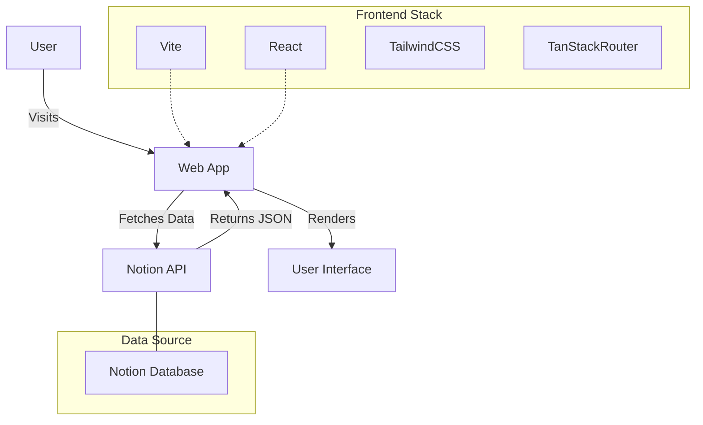

# Foodies DB (Savorsanctum)

A curated directory website powered by Notion as a CMS, built with modern web technologies.

## Overview

Foodies DB is a web app that serves as a catalog for culinary items, products, and reading materials. It leverages Notion's API to fetch content, allowing for easy content management without code changes.

### System Architecture



## Tech Stack

- **Framework**: React 19 + Vite
- **Styling**: TailwindCSS 4
- **Routing**: TanStack Router
- **Data Fetching**: Notion Client
- **Quality Control**: Biome (Linting/Formatting), TypeScript
- **PWA**: Vite PWA

## Getting Started

### Prerequisites

- Node.js v24+
- pnpm v10+
- A Notion Integration Token and Database ID

### Installation

1. Clone the repository.
2. Install dependencies:
   ```bash
   pnpm install
   ```
3. Set up environment variables:
   Create a `.env` file based on `.env.example` (if available) or ensure `VITE_NOTION_TOKEN` is set.

### Development

```bash
pnpm dev
```

### Build

```bash
pnpm build
```

## Documentation

- [AGENTS.md](./AGENTS.md) - Instructions for AI Agents.
- [SPEC.md](./SPEC.md) - Technical specifications and data models.
- [CONTRIBUTING.md](./CONTRIBUTING.md) - Guidelines for contributors.
