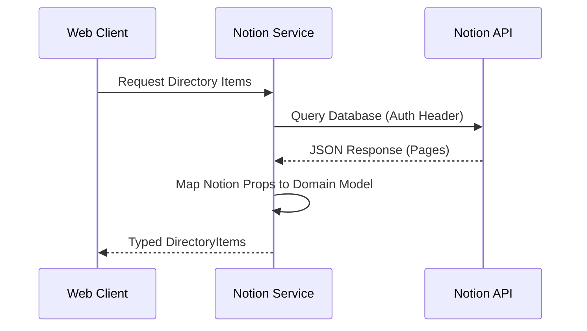

# Specification (SPEC.md)

This document defines the technical specifications, data models, and system invariants for Foodies DB.

## 1. System Invariants

- **Authentication**: All Notion API requests must be authenticated using the token provided in `VITE_NOTION_TOKEN`.
- **Read-Only**: The application treats the Notion database as a read-only source of truth. It does not write back to Notion.
- **Static Generation**: The application is designed to be statically buildable, with data fetched at build time or runtime depending on the configuration.

## 2. Data Models

### Categories
The application supports the following content categories:
- `food`
- `products`
- `reading`

### Directory Item
The core entity is the `DirectoryItem`.

```typescript
type Category = 'food' | 'products' | 'reading';

interface DirectoryItem {
  id: string;
  title: string;
  category: Category;
  image?: string; // URL to the image
  // Additional fields mapped from Notion properties
}
```

## 3. Environment Variables

| Variable | Required | Description |
|----------|----------|-------------|
| `VITE_NOTION_TOKEN` | Yes | API Token for Notion Integration |
| `VITE_NOTION_DATABASE_ID` | Yes | ID of the source Notion database |

## 4. Data Flow


