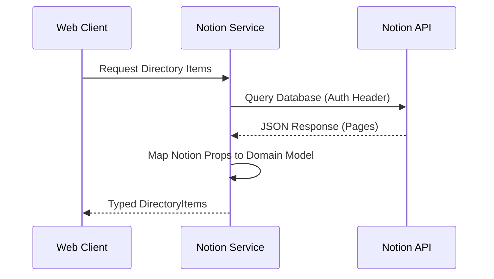

# Specification (SPEC.md)

This document defines the technical specifications, data models, and system invariants for SavorSanctum.

## 1. System Invariants

- **Authentication**: All Notion API requests must be authenticated using the token provided in `VITE_NOTION_TOKEN`.
- **Read-Only**: The application treats the Notion database as a read-only source of truth. It does not write back to Notion.
- **Static Generation**: The application is designed to be statically buildable, with data fetched at build time or runtime depending on the configuration.

## 2. Data Models

### Categories
The application supports the following content categories:
- `food`
- `products`

### Named Entry
A generic entry with just a `name` field, used within other types.

```typescript
interface NamedEntry {
  name: string;
}
```

### Directory Item
The core entity is the `DirectoryItem`.

```typescript
type Category = 'food' | 'products';

interface DirectoryItem {
  id: string;
  name: string;
  category: Category;
  link: string;
  image: string;
  reviews: Array<NamedEntry>;
  tags: Array<NamedEntry>;
  location: Array<NamedEntry>;
  created_time: string;
}
```

## 3. Environment Variables

| Variable | Required | Description |
|----------|----------|-------------|
| `VITE_NOTION_TOKEN` | Yes | API Token for Notion Integration |
| `VITE_NOTION_CULINARIES_DATASOURCE_ID` | Yes | Notion database ID for culinary items |
| `VITE_NOTION_PRODUCTS_DATASOURCE_ID` | Yes | Notion database ID for products |

## 4. Data Flow


